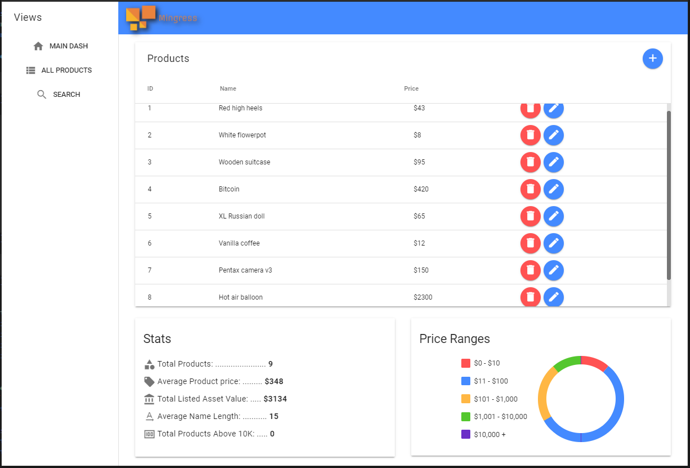
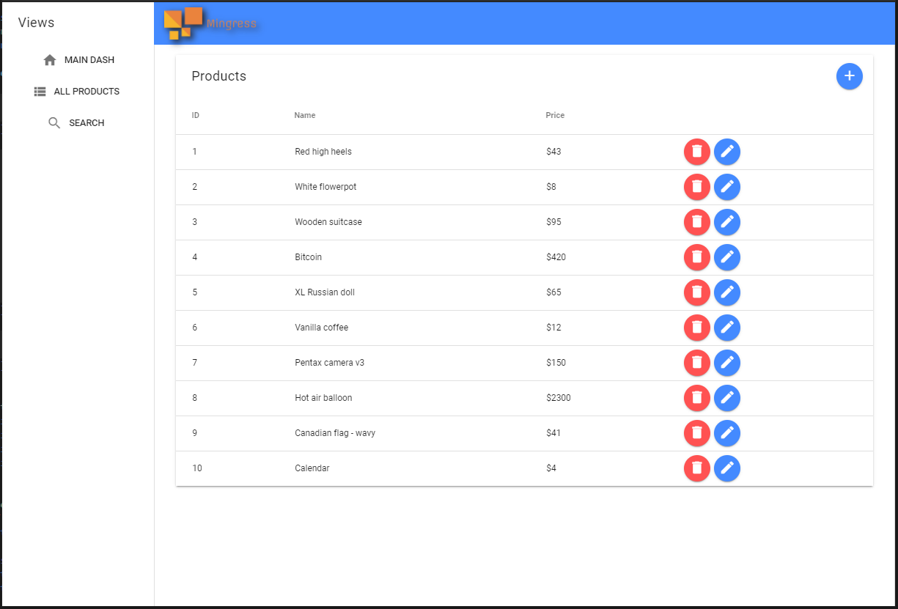
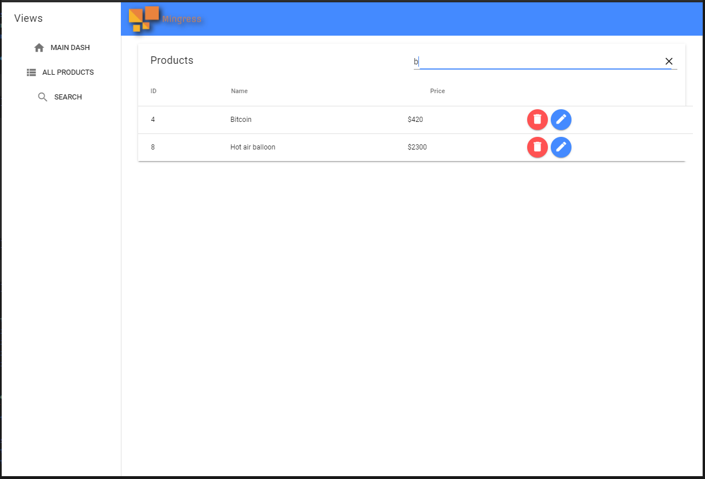

# Mingress
A simple product management dashboard web app.

<div style="text-align: center">
  
  
  
</div>

## Purpose
This web app was originally created to test out a backend with Go, but now serves as a fun public record of random hypothetical products that anyone can access and modify. Check it out at [mingress.edavalos.com](https://mingress.edavalos.com/)

## The Stack
This repository only contains the frontend, but the full application also stores and manages data. The backend source code can be found under the sister repository [Ingress](https://github.com/mtxrii/Ingress).

- Frontend: [VueJS](https://vuejs.org/) (this)
- Backend: [GoLang HTTP](https://golang.org/pkg/net/http/)
- Database: [PostgreSQL](https://www.postgresql.org/)

## Modifying
This app is written in VueJS, and designed to easily be used as a template for larger apps.

#### API Key
The backend ([Ingress](https://github.com/mtxrii/Ingress)) requires that api calls be followed by a secret key configured by its settings. If you're setting up Ingress yourself as well, this key was created by you. Create a new file inside ./src/ named `keys.ts` and fill it in like such:
```
export const keys = {
    backend: 'PASTE KEY HERE'
}
```

#### Project setup
```
npm install
```

#### Compiles and hot-reloads for development
```
npm run serve
```

#### Compiles and minifies for production
```
npm run build
```
